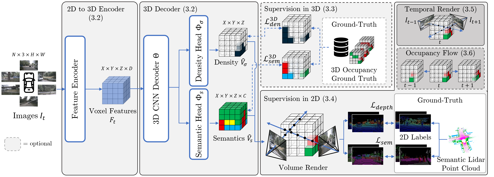

# OccFlowNet: Occupancy Estimation via Differentiable Rendering and Occupancy Flow

Official Implementation of "OccFlowNet: Occupancy Estimation via Differentiable Rendering and Occupancy Flow" by Boeder et al. 

[](https://arxiv.org/abs/2402.12792) 



## Installation

### 1. Create virtual env
```shell script
conda create -n occflownet python=3.8 -y
conda activate occflownet
```

### 2. Install dependencies
Please make sure to have CUDA 11.3 installed and in your PATH.

```shell script
# install pytorch
pip install torch==1.11.0+cu113 torchvision==0.12.0+cu113 torchaudio==0.11.0+cu113 -f https://download.pytorch.org/whl/torch_stable.html

# install openmim, used for installing mmcv
pip install -U openmim

# install mmcv
mim install mmcv-full==1.6.0 -f https://download.openmmlab.com/mmcv/dist/cu113/torch1.11.0/index.html

# install mmdet, mmsegmentation and ninja
pip install mmdet==2.25.1 mmsegmentation==0.25.0 ninja==1.11.1
```

### 3. Install OccFlowNet
Assuming your terminal is in the occflownet directory:
```shell script
pip install -v -e .
```

## Data Preparation
1. Please create a directory `./data` in the root directory of the repository.

2. Download nuScenes AND nuScenes-panoptic [https://www.nuscenes.org/download].

3. Download the Occ3D-nuScenes dataset from [https://github.com/Tsinghua-MARS-Lab/Occ3D]. The download link can be found in their README.md.

4. Copy or softlink the files into the `./data` directory. The structure of the data directory should be as follows:

```shell script
data
├── nuscenes
│  ├── v1.0-trainval (nuScenes+nuScenes-panoptic files)
│  ├── sweeps (nuScenes files)
│  ├── samples (nuScenes files)
│  └── panoptic (nuScenes-panoptic files)
├── gts (Occ3D-nuScenes files)
├── bevdetv2-nuscenes_infos_train.pkl (See step 5)
├── bevdetv2-nuscenes_infos_val.pkl (See step 5)
└── flow (See step 6)
```

5. Generate the annotation files.  This will put the annotation files into the `./data` directory by default. The process can take ~1h.
```shell script
python tools/create_data_bevdet.py
```

6. Generate the flow data (~9 GB). This will put the data into the `./data/flow` directory by default. This process might take around ~5-7h.
```shell script
python tools/create_flow_data.py
```

7. Download pretrained backbone weights for SWIN.
```shell script
mkdir ckpts
cd ckpts
wget https://github.com/pmj110119/storage/releases/download/v1/bevdet-stbase-4d-stereo-512x1408-cbgs.pth
```

## Train model
We provide the three configurations we use in the paper in the `./configs` directory. When you want to train, e.g., with the OccFlowNet 2D with Flow model:
```shell
# single gpu
python tools/train.py configs/occflownet/occflownet_stbase_2d_flow.py
# multiple gpu (replace "num_gpu" with the number of available GPUs) - 4 GPU's are reccomended.
./tools/dist_train.sh configs/occflownet/occflownet_stbase_2d_flow.py num_gpu
```
In order to reproduce the results of the paper, please use 4 GPU's, so that the learning rate remains unchanged.
Also, due to some non-deterministic operations, the results may deviate slightly (up or down) from the results presented in the paper.

## Test model
After training, you can test the model by also providing the chekpoint.
```shell
# single gpu
python tools/test.py configs/occflownet/occflownet_stbase_2d_flow.py work_dirs/occflownet_stbase_2d_flow/epoch_12_ema.pth --eval mIoU
# multiple gpu
./tools/dist_test.sh configs/occflownet/occflownet_stbase_2d_flow.py work_dirs/occflownet_stbase_2d_flow/epoch_12_ema.pth num_gpu --eval mIoU
```

## Common issues
In the following, we list some common errors you might encounter while installing or running this repository, and how to fix them:

1. **No kernel image found for bev_pool_v2**  
If you encounter this error, please uninstall mmdet3d again and make sure you have CUDA 11.3 installed and in your path. Also make sure you have
`ninja==1.11.1` installed via pip. Then run `pip install -v -e .` again to compile the kernel images again.

2. **Error: "from numba.np.ufunc import _internal SystemError: initialization of _internal failed without raising an exception"**  
In this case, please install the numpy version 1.23.5 via `pip install numpy==1.23.5`.

3. **Training stuck, no training logs printed**  
Sometimes the `nerfacc` extension will put a lock on the cuda files. If you do not see any training iteration logs after ~5mins, this might be the issue. Please interrupt the run and remove the lock under `~/.cache/torch_extensions/py38_cu113/nerfacc_cuda/lock`. Restart the training afterwards.

4. **Resume runs**
If the training is interrupted at any point and you want to resume from a checkpoint, you can simply use the `--resume-from` command as follows:
``` shell
./tools/dist_train.sh configs/occflownet/occflownet_stbase_2d_flow.py num_gpu --resume-from /path/to/checkpoint/latest.pth
```
The checkpoints are usually saved under the `work_dirs` directory. By default, a checkpoint is created every 4 epochs.

5. **Environment**  
Please note that this code has only been tested on Linux machines. It is not guaranteed to work on Windows.

## Citation
```
@article{boeder2024occflownet,
  title={Occflownet: Towards self-supervised occupancy estimation via differentiable rendering and occupancy flow},
  author={Boeder, Simon and Gigengack, Fabian and Risse, Benjamin},
  journal={arXiv preprint arXiv:2402.12792},
  year={2024}
}
```

## License

This project is open-sourced under the AGPL-3.0 license. See the
[LICENSE](LICENSE) file for details.

For a list of other open source components included in this project, see the
file [3rd-party-licenses.txt](3rd-party-licenses.txt).


## Purpose of the project

This software is a research prototype, solely developed for and published as
part of the publication cited above. 

## Contact     

Please feel free to open an issue or contact personally if you have questions, need help, or need explanations. Don't hesitate to write an email to the following email address:
simon.boeder@de.bosch.com

## References
Many thanks to these awesome projects:

```
@article{huang2022bevpoolv2,
  title={BEVPoolv2: A Cutting-edge Implementation of BEVDet Toward Deployment},
  author={Huang, Junjie and Huang, Guan},
  journal={arXiv preprint arXiv:2211.17111},
  year={2022}
}

@article{huang2022bevdet4d,
  title={BEVDet4D: Exploit Temporal Cues in Multi-camera 3D Object Detection},
  author={Huang, Junjie and Huang, Guan},
  journal={arXiv preprint arXiv:2203.17054},
  year={2022}
}

@article{huang2021bevdet,
  title={BEVDet: High-performance Multi-camera 3D Object Detection in Bird-Eye-View},
  author={Huang, Junjie and Huang, Guan and Zhu, Zheng and Yun, Ye and Du, Dalong},
  journal={arXiv preprint arXiv:2112.11790},
  year={2021}
}
```